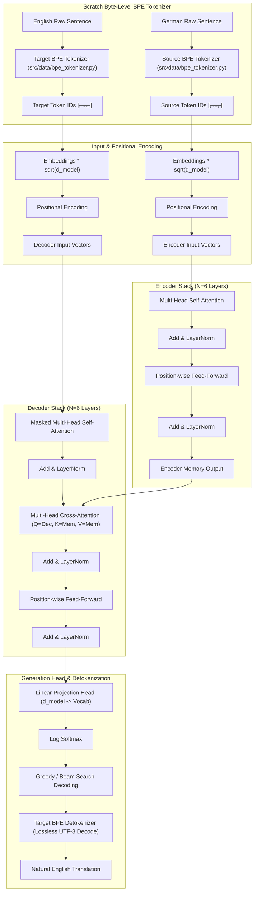

# 🤖 The Annotated Transformer — Modular PyTorch Implementation

A modular, production-grade PyTorch implementation of **The Annotated Transformer** based on the seminal paper [*Attention Is All You Need* (Vaswani et al., 2017)](https://arxiv.org/abs/1706.03762). Refactored from the Harvard NLP annotated notebook into an extensible, config-driven Python package structure with custom utilities, gradient accumulation, GPU VRAM optimization, **Custom Byte-Level BPE Tokenizer Built From Scratch**, **Perplexity & BLEU Score Evaluation**, and **MLflow Experiment Tracking**.

---

## 📐 1. Transformer Architecture & Flow



---

## 🧮 2. Mathematical Formulations

### 2.1 Scaled Dot-Product Attention
Given queries $Q \in \mathbb{R}^{n \times d_k}$, keys $K \in \mathbb{R}^{m \times d_k}$, and values $V \in \mathbb{R}^{m \times d_v}$:

$$\text{Attention}(Q, K, V) = \text{softmax}\left(\frac{Q K^T}{\sqrt{d_k}}\right) V$$

*where $\sqrt{d_k}$ is the scaling factor preventing vanishing gradients in softmax for large dimensions.*

### 2.2 Multi-Head Attention
Projects queries, keys, and values $h$ times with parameter matrices $W_i^Q, W_i^K, W_i^V$:

$$\text{MultiHead}(Q, K, V) = \text{Concat}(\text{head}_1, \dots, \text{head}_h) W^O$$

$$\text{where } \text{head}_i = \text{Attention}\left(Q W_i^Q, K W_i^K, V W_i^V\right)$$

- $W_i^Q \in \mathbb{R}^{d_{\text{model}} \times d_k}$
- $W_i^K \in \mathbb{R}^{d_{\text{model}} \times d_k}$
- $W_i^V \in \mathbb{R}^{d_{\text{model}} \times d_v}$
- $W^O \in \mathbb{R}^{h d_v \times d_{\text{model}}}$

### 2.3 Sinusoidal Positional Encoding
Fixes sequence position information without recurrence:

$$PE_{(pos, 2i)} = \sin\left(\frac{pos}{10000^{2i / d_{\text{model}}}}\right)$$

$$PE_{(pos, 2i+1)} = \cos\left(\frac{pos}{10000^{2i / d_{\text{model}}}}\right)$$

*where $pos$ is position index and $i$ is channel dimension.*

### 2.4 Position-wise Feed-Forward Networks (FFN)

$$\text{FFN}(x) = \max(0, x W_1 + b_1) W_2 + b_2$$

- $W_1 \in \mathbb{R}^{d_{\text{model}} \times d_{\text{ff}}}$
- $W_2 \in \mathbb{R}^{d_{\text{ff}} \times d_{\text{model}}}$

### 2.5 Layer Normalization
Normalizes over feature dimension for each token independently (Pre-LN connection architecture):

$$\text{LN}(x) = \gamma \odot \left(\frac{x - \mu}{\sqrt{\sigma^2 + \epsilon}}\right) + \beta$$

$$\text{Sublayer Connection: } x + \text{Dropout}\left(\text{Sublayer}(\text{LN}(x))\right)$$

### 2.6 Noam Learning Rate Schedule
Dynamic learning rate schedule based on model size and warmup steps:

$$\text{lr} = \text{factor} \cdot \left( d_{\text{model}}^{-0.5} \cdot \min\left( \text{step}^{-0.5}, \text{step} \cdot \text{warmup}^{-1.5} \right) \right)$$

### 2.7 Label Smoothing (KL Divergence Loss)
Regularization technique distributing confidence $\epsilon$ across non-target vocabulary tokens:

$$q(y \mid x) = \begin{cases} 1 - \epsilon + \frac{\epsilon}{K}, & \text{if } y = \text{target} \\ \frac{\epsilon}{K}, & \text{if } y \neq \text{target} \end{cases}$$

### 2.8 Perplexity (PPL)
Measures how well the model predicts target word sequences (lower is better):

$$\text{PPL} = \exp(\mathcal{L}) = e^{\mathcal{L}}$$

*where $\mathcal{L}$ is the cross-entropy / label smoothing loss per target token.*

### 2.9 BLEU Score (Bilingual Evaluation Understudy)
Evaluates machine translation quality against human reference translations:

$$\text{BLEU} = \text{BP} \cdot \exp\left( \sum_{n=1}^N w_n \log p_n \right)$$

$$\text{where } \text{BP} = \begin{cases} 1 & \text{if } c > r \\ e^{(1 - r/c)} & \text{if } c \le r \end{cases}$$

---

## 🔤 3. Custom Scratch Byte-Level BPE Tokenizer

Rather than relying on third-party black-box tokenizers (like Hugging Face `tokenizers` or Google `sentencepiece`), or language-dependent word tokenizers (like SpaCy), this project features a **pure-Python Byte-Level Byte Pair Encoding (BPE) Tokenizer built entirely from scratch** (`src/data/bpe_tokenizer.py`).

### Key Architectural Features:
1. **Reversible 256-Byte to Unicode Bijection (GPT-2 Style)**:
   - Maps all 256 raw UTF-8 byte values (0–255) to unique printable Unicode characters.
   - Any character in any language (including German umlauts `ä, ö, ü, ß, Ä, Ö, Ü`, numbers, and emojis) decomposes into base bytes.
   - **Zero Out-of-Vocabulary (`<unk>`) Rate**: Guarantees that any string can be encoded and 100% losslessly reconstructed.
2. **Pre-Tokenization Regex**:
   - Uses the regex pattern `r"""'s|'t|'re|'ve|'m|'ll|'d| ?\p{L}+| ?\p{N}+| ?[^\s\p{L}\p{N}]+|\s+(?!\S)|\s+"""` to preserve whitespace and word boundaries before merging.
3. **High-Performance Inverted-Index Trainer**:
   - Maintains an inverted index (`pair_to_words: Dict[Tuple, Set[int]]`) during training.
   - When the most frequent adjacent pair is merged, only the affected words are recalculated.
   - Trains all 7,740 merges on the Multi30k dataset (~29,000 sentences) in **~6 seconds** in pure Python.
4. **Special Tokens**:
   - Fully standardized: `<unk>=0`, `<blank>=1`, `<s>=2`, `</s>=3`.
5. **Lossless Detokenization**:
   - Subwords are seamlessly merged back into natural English sentences during inference and evaluation, eliminating subword artifacts (e.g. `@@`, `##`, or artificial whitespace).

### Tokenizer Training Command:
```bash
# Train German and English BPE tokenizers (default vocab size: 8000)
python train_tokenizer.py --vocab_size 8000 --output_dir outputs

# Optionally train a single shared multilingual tokenizer
python train_tokenizer.py --vocab_size 8000 --output_dir outputs --shared
```

---

## ⚡ 4. Hardware & VRAM Optimization for RTX 3050 (4GB VRAM)

Training Transformer models can quickly exceed GPU VRAM limits. This project includes tailored optimizations to train efficiently on **NVIDIA RTX 3050 (4GB VRAM)** GPUs without running into `CUDA Out-Of-Memory (OOM)` errors.

### VRAM Footprint Breakdown

| Component | Standard Setup (`batch_size=32`) | **Optimized Setup (`batch_size=16`)** |
|---|---|---|
| **Model Parameters (~65M FP32)** | ~260 MB | ~260 MB |
| **Adam Optimizer States ($m, v$)** | ~520 MB | ~520 MB |
| **Gradients (FP32)** | ~260 MB | ~260 MB |
| **Activation Memory (Forward/Backward)** | ~2.1 GB | **~0.9 GB** |
| **PyTorch Context & CUDA Overhead** | ~0.5 GB | ~0.5 GB |
| **Peak VRAM Memory** | **~3.64 GB** *(High OOM Risk on Windows)* | **~2.44 GB** *(Fits comfortably in 4GB)* |

### Key Optimization Strategies Applied
1. **Micro-Batching (`batch_size=16`)**: Reduces peak activation tensor memory from `2.1 GB` to `0.9 GB`.
2. **Gradient Accumulation (`accum_iter=20`)**: Accumulates gradients across 20 micro-batches before executing optimizer step:
   $$\text{Effective Batch Size} = \text{batch size} \times \text{accum iter} = 16 \times 20 = 320$$
3. **Causal & Padding Masking**: Memory-efficient lower triangular causal masks (`subsequent_mask`) generated dynamically per batch.

---

## 📊 5. MLflow Experiment Tracking & Metric Logging

Integrated experiment tracking via **MLflow** automatically records parameters, loss metrics, perplexity, BLEU scores, learning rate schedules, and model artifacts per training run using an SQLite database backend (`sqlite:///mlflow.db`).

### Tracked Metrics & Parameters
- **Hyperparameters (`mlflow.log_params`)**: `num_epochs`, `batch_size`, `accum_iter`, `base_lr`, `warmup`, `d_model`, `d_ff`, `num_layers`, `num_heads`, `dropout`, `label_smoothing`, `src_vocab_size`, `tgt_vocab_size`, `total_parameters`, `device`, `seed`.
- **Per-Epoch Metrics (`mlflow.log_metric`)**: `train_loss`, `val_loss`, `val_perplexity`, `learning_rate` per epoch.
- **Evaluation Metrics**: `eval_val_loss`, `eval_perplexity`, `eval_bleu_score`.
- **Artifacts (`mlflow.log_artifact`)**: Saved model checkpoints (`.pt`), BPE tokenizer states (`bpe_de.json`, `bpe_en.json`), vocabulary mapping (`vocab.pt`), and run configuration (`config.yaml`).

### Viewing MLflow Dashboard
Launch the local MLflow web UI server to inspect runs, metric curves, and parameter comparisons:
```bash
mlflow ui --backend-store-uri sqlite:///mlflow.db
```
*Open your browser and navigate to `http://127.0.0.1:5000` to view interactive experiment dashboards.*

---

## 📂 6. Project Directory Structure

```
Annotated-Transformer/
├── config/
│   └── config.yaml                 # Central hyperparameter, BPE tokenizer & MLflow config
├── notebooks/
│   └── AnnotatedTransformer.ipynb  # Original reference research notebook
├── outputs/
│   ├── bpe_de.json                 # Trained German scratch Byte-Level BPE tokenizer
│   ├── bpe_en.json                 # Trained English scratch Byte-Level BPE tokenizer
│   └── vocab.pt                    # Synchronized vocabulary mapping
├── src/
│   ├── __init__.py
│   ├── models/                     # Transformer Model Architecture Components
│   │   ├── __init__.py
│   │   ├── attention.py            # MultiHeadedAttention & Scaled Dot-Product Attention
│   │   ├── layers.py               # EncoderLayer, DecoderLayer, SublayerConnection, LayerNorm, FeedForward
│   │   ├── embeddings.py           # Embeddings & Sinusoidal PositionalEncoding
│   │   ├── encoder_decoder.py      # Encoder, Decoder, EncoderDecoder & Generator
│   │   └── build_model.py          # make_model factory & Xavier parameter initialization
│   ├── data/                       # Dataset & Tokenization Pipeline
│   │   ├── __init__.py
│   │   ├── bpe_tokenizer.py        # Pure-Python Scratch Byte-Level BPE Tokenizer Engine
│   │   ├── tokenizer.py            # Tokenizer loading & adapter utilities
│   │   ├── vocab.py                # Vocab abstraction deriving from BPE tokenizers
│   │   ├── batch.py                # Batch wrapper & causal subsequent_mask
│   │   └── dataset.py              # Multi30kDataset, BPE collate_fn & synthetic data_gen
│   ├── training/                   # Loss, Schedulers & Trainer Engine
│   │   ├── __init__.py
│   │   ├── loss.py                 # LabelSmoothing loss & SimpleLossCompute
│   │   ├── scheduler.py            # Noam LR rate schedule & get_std_opt wrapper
│   │   └── trainer.py              # TrainState, run_epoch & train_model loop with MLflow
│   ├── inference/                  # Generation & Decoding Algorithms
│   │   ├── __init__.py
│   │   └── generator.py            # greedy_decode, beam_search_decode & BPE Translator
│   ├── evaluation/                 # Metrics & Model Evaluator Engine
│   │   ├── __init__.py
│   │   ├── metrics.py              # calculate_perplexity & calculate_bleu (SacreBLEU/NLTK/Fallback)
│   │   └── evaluator.py            # evaluate_model driver for loss, PPL & BLEU
│   └── visualization/              # Diagnostic Heatmaps
│       ├── __init__.py
│       └── attention_viz.py        # Altair attention map DataFrames & visualizations
├── tests/
│   └── test_bpe_tokenizer.py       # Unit tests for Scratch Byte-Level BPE Tokenizer
├── utils/
│   ├── __init__.py
│   ├── custom_exception.py         # Detailed traceback exception handler
│   ├── helper.py                   # YAML reader & file utilities
│   └── logger.py                   # Centralized logging module
├── train_tokenizer.py              # CLI entry point to train scratch Byte-Level BPE tokenizers
├── train.py                        # Training pipeline entry point (MLflow enabled)
├── evaluate.py                     # Validation evaluation entry point (Loss, PPL, BLEU)
├── predict.py                      # Translation CLI entry point (Greedy / Beam Search)
├── requirements.txt                # Package dependencies
└── setup.py                        # Package installation manifest
```

---

## 🚀 7. Quickstart & Usage

### 7.1 Environment Setup
Clone the repository and install requirements:
```bash
git clone https://github.com/Sumit-Prasad01/Annotated-Transformer.git
cd Annotated-Transformer
pip install -r requirements.txt
pip install -e .
```

Run unit tests to verify the scratch Byte-Level BPE tokenizer:
```bash
python -m unittest tests/test_bpe_tokenizer.py
```

### 7.2 Train Byte-Level BPE Tokenizers
Train source (German) and target (English) tokenizers on Multi30k:
```bash
python train_tokenizer.py --vocab_size 8000 --output_dir outputs
```
*(If omitted, `train.py` will automatically detect missing tokenizers and train them on launch).*

### 7.3 Model Training
Run end-to-end model training with automatic device detection and MLflow tracking:
```bash
python train.py --config config/config.yaml
```

*Training logs are stored in `logs/`, MLflow runs in `mlflow.db`, and best model checkpoints are saved to `outputs/multi30k_model_best.pt`.*

### 7.4 Model Evaluation (Loss, Perplexity & BLEU Score)
Evaluate validation loss, perplexity, and BLEU score on the Multi30k test dataset:

```bash
# Evaluate with Greedy Decoding (Default)
python evaluate.py --config config/config.yaml

# Evaluate with Beam Search Decoding (Beam Width = 8)
python evaluate.py --config config/config.yaml --beam --beam_size 8

# Evaluate BLEU on a subset of 100 validation samples (Faster)
python evaluate.py --config config/config.yaml --max_samples 100
```

### 7.5 Run Translation Inference (German $\to$ English)
Translate German sentences from the command line with automatic BPE encoding and subword detokenization:

```bash
# Greedy decoding (Fast, Default)
python predict.py --text "Eine Frau kocht ein Gericht in der Küche." --greedy

# Beam search decoding (Higher quality output)
python predict.py --text "Eine Frau kocht ein Gericht in der Küche." --beam --beam_size 8

# Specify custom checkpoint and config
python predict.py --text "Eine Frau kocht ein Gericht in der Küche." --config config/config.yaml --checkpoint outputs/multi30k_model_best.pt --beam
```

---

## ⚙️ 8. Configuration Reference (`config/config.yaml`)

```yaml
# Training schedule (Optimized for 4GB VRAM GPU e.g., RTX 3050)
num_epochs: 8
batch_size: 16            # Micro-batch size to fit in VRAM
accum_iter: 20            # Effective batch size = 16 * 20 = 320
base_lr: 1.0
warmup: 3000

# Model architecture
d_model: 512
d_ff: 2048
num_layers: 6
num_heads: 8
dropout: 0.1
label_smoothing: 0.1

# Data
max_padding: 72
vocab_min_freq: 2
language_pair: ["de", "en"]

# Tokenizer (Scratch Byte-Level BPE)
tokenizer:
  algorithm: "byte_level_bpe"
  vocab_size: 8000
  src_path: "outputs/bpe_de.json"
  tgt_path: "outputs/bpe_en.json"
  shared: false

# Paths
output_dir: outputs
checkpoint_prefix: multi30k_model_
vocab_path: outputs/vocab.pt
dashboard_path: outputs/dashboard.html
metrics_path: outputs/metrics.json

# Runtime
device: auto              # Automatically uses CUDA GPU if available
distributed: false
seed: 42

# Evaluation & Metrics (Loss, Perplexity, BLEU Score)
eval_every_epoch: true
max_decode_len: 72
eval_decoding: greedy     # Decoding strategy for BLEU evaluation: "greedy" or "beam"
eval_beam_size: 5         # Beam search width when eval_decoding is "beam"
eval_max_samples: null    # Max samples for BLEU score evaluation (null evaluates full val set)

# MLflow Experiment Tracking
mlflow:
  enabled: true
  experiment_name: "Annotated_Transformer_Multi30k"
  tracking_uri: "sqlite:///mlflow.db"
  log_artifacts: true
```

---

## 📜 9. Citation & Acknowledgments

- **Original Paper**: Vaswani et al., *"Attention Is All You Need"*, NeurIPS 2017. [arXiv:1706.03762](https://arxiv.org/abs/1706.03762)
- **Subword NMT Paper**: Rico Sennrich et al., *"Neural Machine Translation of Rare Words with Subword Units"*, ACL 2016. [arXiv:1508.07909](https://arxiv.org/abs/1508.07909)
- **Harvard NLP**: Sasha Rush et al., *The Annotated Transformer*, [Harvard NLP Blog](https://nlp.seas.harvard.edu/2018/04/03/attention.html).
